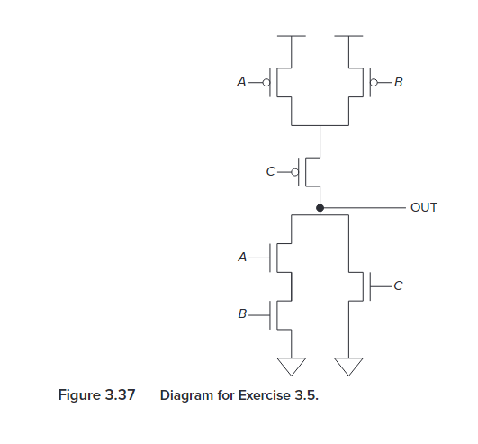
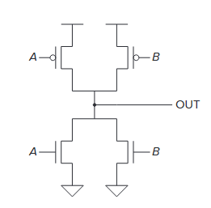
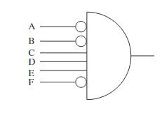
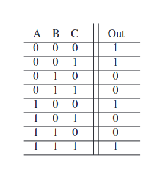
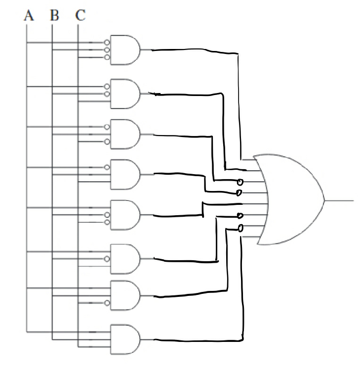
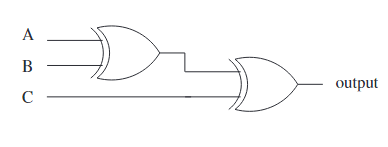
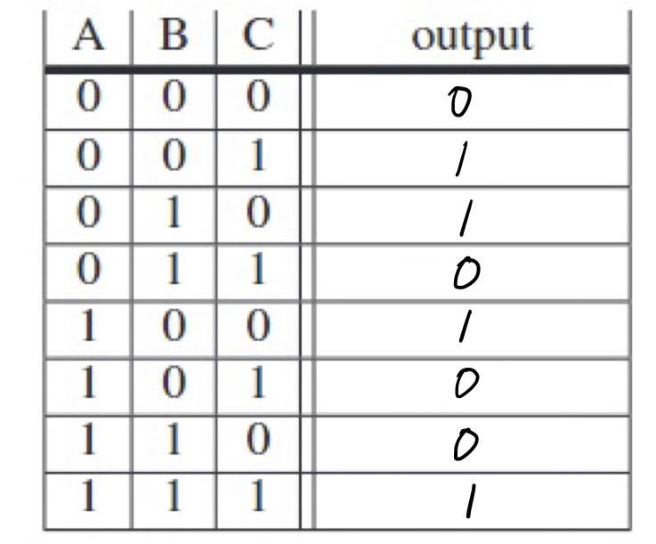
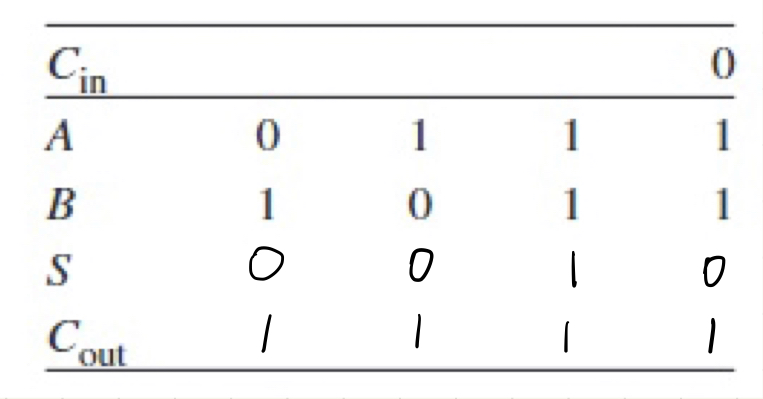
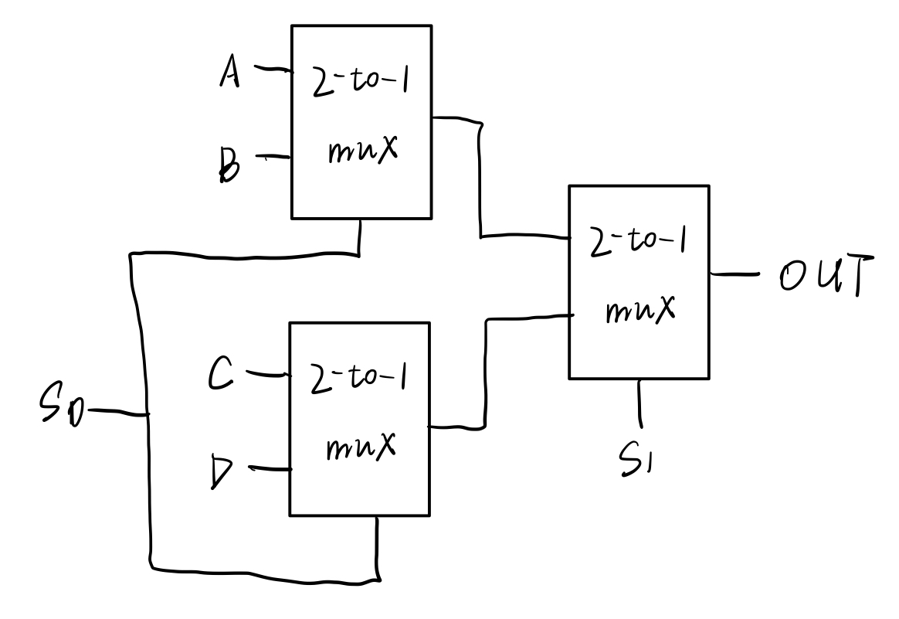

# Assignment 1

余北辰 519030910245

**3.5 Complete a truth table for the transistor-level circuit in Figure 3.37.**

|  A   |  B   |  C   | OUT  |
| :--: | :--: | :--: | :--: |
|  0   |  0   |  0   |  1   |
|  0   |  0   |  1   |  0   |
|  0   |  1   |  0   |  1   |
|  0   |  1   |  1   |  0   |
|  1   |  0   |  0   |  1   |
|  1   |  0   |  1   |  0   |
|  1   |  1   |  0   |  0   |
|  1   |  1   |  1   |  0   |

---

**3.7 The following circuit has a major flaw. Can you identify it?**

**Hint: Evaluate the circuit for all sets of inputs.**

When A = 1, B = 0 or A = 0, B = 1, the upper and lower parts of the circuit will conduct, so there will be a short circuit.

---

**3.10 For what values of A, B, C, D, E, and F will the output of the six-input AND gate be 1?**

When A=0, B=0, C=1, D=1, E=1, F=0.

---

**3.12 A function is described by the truth table shown on the left. Your job: Complete the logic implementation shown on the right by adding the appropriate connections.**

My answer:

---

**3.14 The following logic circuits consist of two exclusive-OR gates. Construct the output truth table.**

My answer:

---

**3.21 If A and B are four-bit unsigned binary numbers, 0111 and 1011, complete the table obtained when using a two-bit full adder from Figure 3.15 to calculate each bit of the sum, S , of A and B. Check your answer by adding the decimal value of A and B and comparing the sum with S. Are the answers the same? Why or why not?**

A = 7, B = 11, S = A + B = 18 , but in the above calculation, we have S = 2.

Because 18 is too big to be represented by 4 bits.

---

**3.27 You know a byte is eight bits. We call a four-bit quantity a nibble. If a byte-addressable memory has a 14-bit address, how many nibbles of storage are in this memory?**

14-bit address means there are $2^{14}=16384$ memory locations in total. In each location, there is a byte, which is two nibbles. So there are $2\times 16384 = 32768$ nibbles of storage in this memory.

---

**3.28 Implement a 4-to-1 mux using only 2-to-1 muxes making sure to properly connect all of the terminals. Remember that you will have four inputs, two control signals, and one output. Write out the truth table for this circuit.**

| $S_0$ | $S_1$ | OUT  |
| :---: | :---: | :--: |
|   0   |   0   |  A   |
|   1   |   0   |  B   |
|   0   |   1   |  C   |
|   1   |   1   |  D   |

---

**3.38 Distinguish between a memory address and the memory’s addressability.**

A memory address refers to a location in memory. 

Memory's addressability is the number of bits stored in each memory location.